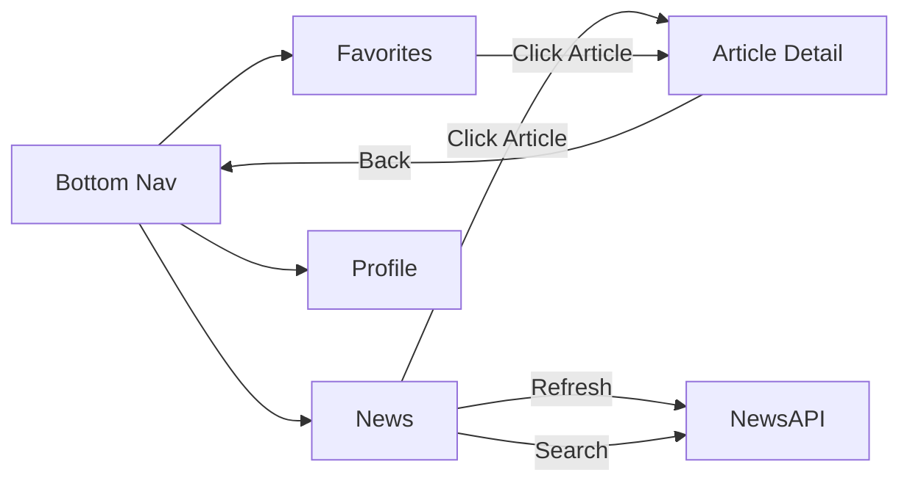
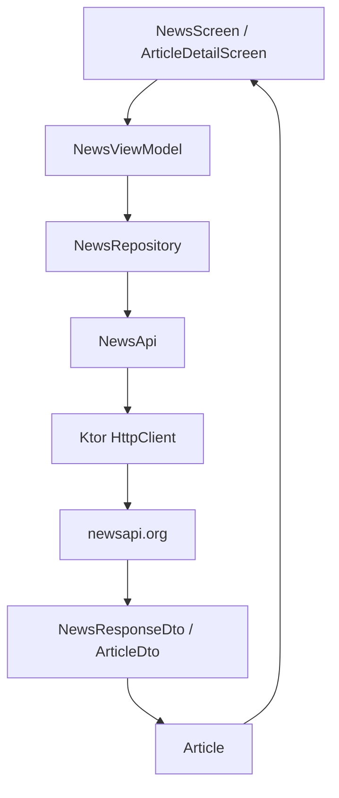

# 📰 Tugas 6 - News Reader App dengan NewsAPI

<p align="center">
  
  
  
</p>

## 👤 Informasi Mahasiswa
| Data Diri | Keterangan |
| :--- | :--- |
| **Nama** | Awi Septian Prasetyo |
| **NIM** | 123140201 |
| **Mata Kuliah** | Pengembangan Aplikasi Mobile (PAM) |
| **Program Studi** | Teknik Informatika |
| **Institusi** | Institut Teknologi Sumatera (ITERA) |

---

## 📖 Deskripsi Proyek
Proyek ini merupakan evolusi dari **Tugas 5 - Notes App Navigation** menjadi **Tugas 6 - News Reader App**. Fondasi navigasi, *State Management*, dan *Dark Mode* tetap dipertahankan, namun kini dikembangkan menjadi aplikasi pembaca berita dinamis yang terintegrasi dengan **NewsAPI**.

Aplikasi ini menggunakan **Ktor Client** untuk melakukan *request* ke *public endpoint* dan menyajikannya dalam antarmuka yang responsif dan modern.

### 🎯 Fitur Tugas 6
*   **Fetch Berita:** Integrasi REST API menggunakan NewsAPI.
*   **Ktor Client:** HTTP request multiplatform untuk performa tinggi.
*   **Repository Pattern:** Pemisahan logika data menggunakan `NewsRepository`.
*   **State Management:** Penanganan *Loading, Success,* dan *Error* yang reaktif.
*   **Search & Refresh:** Fitur pencarian kata kunci dan pembaruan data secara instan.
*   **Favorites:** Menyimpan artikel pilihan ke dalam daftar favorit.

---

## 📱 Hasil Video & Screenshot

### 🎥 Demo Video
> **Tonton demo aplikasi di sini:** 
> [🔗 Video Demo Aplikasi - Google Drive](https://drive.google.com/drive/folders/1_LfpLpUr39LGJHy_cD_H-1eySeB6txRK?usp=sharing)

### 📸 Screenshot Dokumentasi

| News Page | Article Detail Page |
| :---: | :---: |
|  |  |
| **Favorite Page** | **Profil Page** |
|  |  |

---

## 🔐 Konfigurasi API Key
API key dikelola secara aman melalui file `local.properties` (sudah masuk `.gitignore`):

```properties
# local.properties
NEWS_API_KEY=ISI_API_KEY_NEWSAPI_KAMU_DI_SINI
```

---

## 🚦 Alur Navigasi (Navigation Flow)



---

## 🧱 Arsitektur Data



---

## 📂 Struktur Folder

```text
composeApp/src/commonMain/kotlin/org/example/project/
├── config/             # Expect API config (Platform-specific API key)
├── data/               # Model (Article, Profile) & Repository
│   ├── remote/         # Ktor Client & API Interface
│   └── repository/     # NewsRepository logic
├── navigation/         # NavHost & Routes
│   ├── AppNavigation.kt
│   └── Screen.kt
├── ui/                 # UI Layer
│   ├── components/     # Reusable components (ArticleCard, dll)
│   ├── screens/        # News, Detail, & Profile Screen
│   └── theme/          # AppTheme (Dark/Light Mode)
└── viewmodel/          # UI State (NewsUiState, ProfileViewModel)
```

---

## 🛠️ Teknologi yang Digunakan
*   **Kotlin Multiplatform & Compose Multiplatform**
*   **Ktor Client** & **Kotlinx Serialization**
*   **Coil 3** (Image Loading)
*   **MVVM Architecture**
*   **Material 3 Components**

---

## 🧪 Demo States
| State | Cara Demo |
| :--- | :--- |
| **Loading** | Muncul saat aplikasi pertama kali memuat data. |
| **Success** | Daftar berita tampil setelah data diterima dari API. |
| **Error** | Salahkan API key untuk melihat pesan error dan tombol Retry. |
| **Refresh** | Klik tombol Refresh pada tab News. |
| **Favorites** | Tambahkan bintang pada artikel dan buka tab Favorites. |

---
