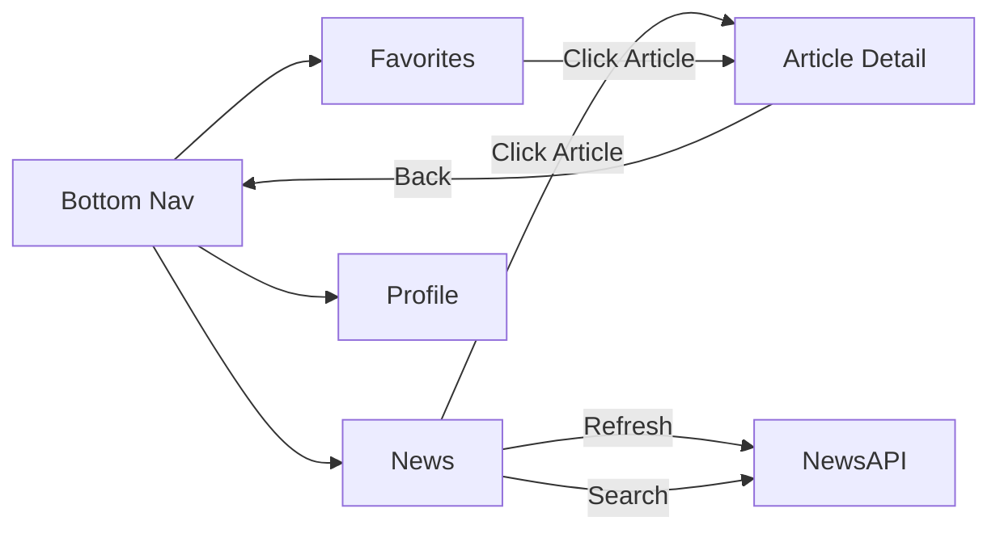
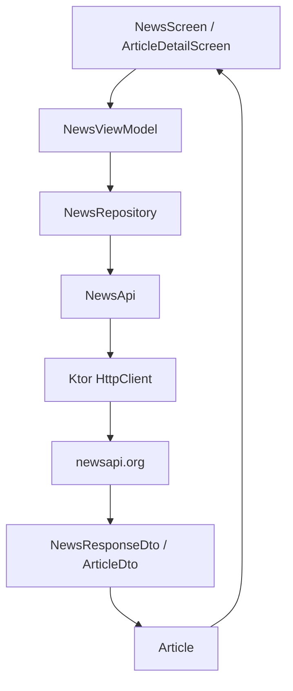

# 📰 Tugas 6 - News Reader App dengan NewsAPI

<p align="center">
  
  
  
</p>

## 👤 Informasi Mahasiswa

| Data Diri | Keterangan |
| :--- | :--- |
| **Nama** | Awi Septian Prasetyo |
| **NIM** | 123140201 |
| **Mata Kuliah** | Pengembangan Aplikasi Mobile (PAM) |
| **Program Studi** | Teknik Informatika |
| **Institusi** | Institut Teknologi Sumatera (ITERA) |

---

## 📖 Deskripsi Proyek

Project ini merupakan evolusi dari **Tugas 5 - Notes App Navigation** menjadi **Tugas 6 - News Reader App**.
Fondasi Tugas 5 tetap dipertahankan, seperti Navigation Compose, Bottom Navigation, Profile Screen, MVVM, dan Dark Mode. Pada Tugas 6, aplikasi dikembangkan menjadi pembaca berita dengan integrasi **REST API menggunakan Ktor Client** dan data dari **NewsAPI**.

Aplikasi mengambil headline terbaru dari endpoint:

```text
GET https://newsapi.org/v2/top-headlines?country=us&pageSize=20
```

Authentication dikirim melalui header:

```text
X-Api-Key: NEWS_API_KEY
```

---

## ✅ Fitur Tugas 6

1. **Fetch berita dari public API** menggunakan NewsAPI.
2. **Ktor Client** untuk HTTP request multiplatform.
3. **Kotlinx Serialization** untuk parsing JSON response.
4. **Repository Pattern** melalui `NewsRepository`.
5. **Loading, Success, Error State** melalui `NewsUiState` dan `NewsViewModel`.
6. **List artikel** dengan title, description, source, tanggal, dan image.
7. **Article Detail Screen** dengan passing `articleId` sebagai argument navigasi.
8. **Refresh functionality** melalui tombol Refresh.
9. **Search headline** berdasarkan keyword.
10. **Favorite articles** pada tab Favorites.
11. **Profile dan Dark Mode** dari tugas sebelumnya tetap dipertahankan.

---

## 🔐 Konfigurasi API Key

API key tidak ditanam langsung di source code Kotlin. Key dibaca dari `local.properties` lalu dimasukkan ke `BuildConfig` Android.

File yang dipakai:

```properties
# local.properties
NEWS_API_KEY=ISI_API_KEY_NEWSAPI_KAMU_DI_SINI
```

File `local.properties` sudah masuk `.gitignore`, sehingga tidak ikut ter-commit ke GitHub. Jika membuka project di komputer baru, gunakan `local.properties.example` sebagai contoh.

---

## 🚦 Alur Navigasi



---

## 🧱 Arsitektur Data



---

## 📂 Struktur Folder Utama

```text
composeApp/src/commonMain/kotlin/org/example/project/
├── config/
│   └── ApiConfig.kt                    # expect API config
├── data/
│   ├── Article.kt                      # Model UI artikel
│   ├── Note.kt                         # Model lama dipertahankan untuk tugas berikutnya
│   ├── Profile.kt
│   ├── remote/
│   │   ├── HttpClientFactory.kt        # Setup Ktor Client
│   │   ├── NewsApi.kt                  # Request ke NewsAPI
│   │   └── dto/
│   │       └── NewsResponseDto.kt      # DTO JSON response
│   └── repository/
│       └── NewsRepository.kt           # Repository pattern
├── navigation/
│   ├── AppNavigation.kt
│   ├── BottomNavBar.kt
│   └── Screen.kt
├── ui/
│   ├── components/
│   │   └── ArticleCard.kt
│   ├── screens/
│   │   ├── NewsScreen.kt
│   │   ├── ArticleDetailScreen.kt
│   │   └── ProfileScreen.kt
│   └── theme/
│       └── AppTheme.kt
└── viewmodel/
    ├── NewsUiState.kt
    ├── NewsViewModel.kt
    ├── NotesViewModel.kt               # Legacy tugas 5 dipertahankan
    └── ProfileViewModel.kt
```

Platform-specific API key:

```text
composeApp/src/androidMain/kotlin/org/example/project/config/ApiConfig.android.kt
composeApp/src/jvmMain/kotlin/org/example/project/config/ApiConfig.jvm.kt
composeApp/src/iosMain/kotlin/org/example/project/config/ApiConfig.ios.kt
```

---

## 🛠️ Teknologi yang Digunakan

- Kotlin Multiplatform
- Compose Multiplatform
- Material 3
- Navigation Compose
- ViewModel + StateFlow
- Ktor Client
- Kotlinx Serialization
- Coil 3 untuk image loading
- NewsAPI

---

## ▶️ Cara Menjalankan

1. Buka project di Android Studio.
2. Pastikan file `local.properties` tersedia di root project.
3. Isi API key:

```properties
NEWS_API_KEY=ISI_API_KEY_NEWSAPI_KAMU
```

4. Sync Gradle.
5. Jalankan konfigurasi Android `composeApp`.

---

## 🧪 States yang Perlu Ditunjukkan Saat Demo

| State | Cara Demo |
| :--- | :--- |
| Loading | Buka aplikasi pertama kali |
| Success | Setelah artikel berhasil tampil |
| Error | Kosongkan/salahkan API key lalu tekan Retry |
| Refresh | Tekan tombol Refresh pada News Screen |
| Detail | Tap salah satu artikel |
| Favorites | Tap bintang pada artikel, lalu buka tab Favorites |
| Dark Mode | Buka Profile, aktifkan Dark Mode |

---
