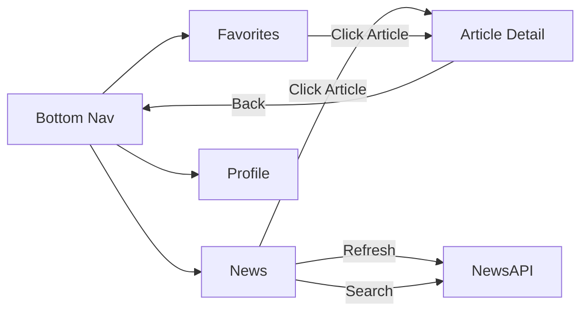
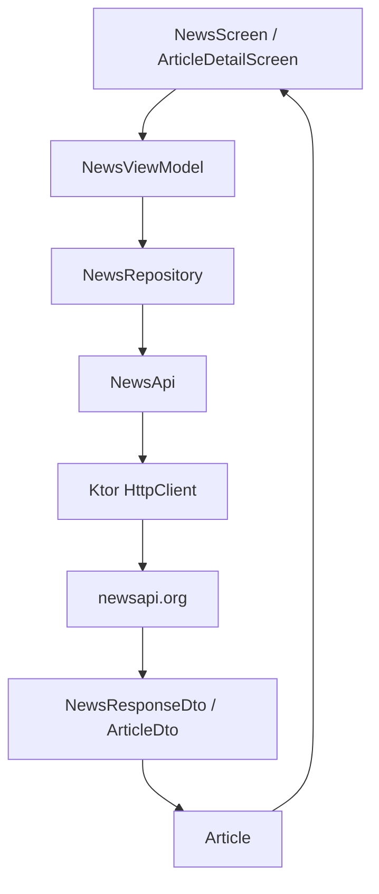

```

---

## 🛠️ Teknologi yang Digunakan

*   **Kotlin Multiplatform & Compose Multiplatform**
*   **Material 3** & **Navigation Compose**
*   **Ktor Client** (Networking)
*   **Kotlinx Serialization** (JSON Parsing)
*   **Coil 3** (Image Loading)
*   **ViewModel + StateFlow**

---

## 🧪 Demo States

| State | Cara Demo |
| :--- | :--- |
| **Loading** | Muncul saat aplikasi pertama kali mengambil data. |
| **Success** | Artikel tampil dengan gambar dan deskripsi lengkap. |
| **Error** | Ubah API key menjadi salah untuk melihat pesan error/retry. |
| **Refresh** | Gunakan tombol Refresh untuk memperbarui daftar berita. |
| **Favorites** | Klik ikon bintang pada artikel dan cek di tab Favorites. |
| **Dark Mode** | Aktifkan melalui menu Profile. |

---

## 💻 Cara Menjalankan

1.  Clone repositori ini.
2.  Pastikan `local.properties` sudah dikonfigurasi dengan API Key.
3.  LTentu, ini adalah draf `README.md` untuk **Tugas 6** yang telah dirapikan menggunakan template profesional dari tugas sebelumnya, dengan mengintegrasikan seluruh konten Tugas 6, link video, dan grid foto yang Anda berikan.

---

# 📰 Tugas 6 - News Reader App dengan NewsAPI

<p align="center">
  
  
  
</p>

## 👤 Informasi Mahasiswa

| Data Diri | Keterangan |
| :--- | :--- |
| **Nama** | Awi Septian Prasetyo |
| **NIM** | 123140201 |
| **Mata Kuliah** | Pengembangan Aplikasi Mobile (PAM) |
| **Program Studi** | Teknik Informatika |
| **Institusi** | Institut Teknologi Sumatera (ITERA) |

---

## 📖 Deskripsi Proyek

Project ini merupakan evolusi dari **Tugas 5 - Notes App Navigation** menjadi **Tugas 6 - News Reader App**. Fondasi dari tugas sebelumnya tetap dipertahankan, termasuk *Navigation Compose*, *Bottom Navigation*, *Profile Screen*, *MVVM*, dan *Dark Mode*.

Pada pembaruan ini, aplikasi dikembangkan menjadi pembaca berita dinamis dengan integrasi **REST API menggunakan Ktor Client** untuk mengambil data artikel secara *real-time* dari **NewsAPI**.

---

## 🎬 Video & Screenshot

### 🎥 Demo Video
[**Klik di sini untuk melihat video demonstrasi**](https://drive.google.com/drive/folders/1_LfpLpUr39LGJHy_cD_H-1eySeB6txRK?usp=sharing)

### 🖼️ Screenshot Aplikasi
| 1. News Page | 2. Favorite Page |
| :---: | :---: |
|  |  |
| **3. Article Detail Page** | **4. Profile Page** |
|  |  |

---

## ✅ Fitur Utama (Tugas 6)

*   **Fetch Berita Real-time**: Mengambil headline terbaru menggunakan NewsAPI.
*   **Ktor Client**: Implementasi HTTP request yang mendukung multiplatform.
*   **Repository Pattern**: Manajemen data yang terpusat melalui `NewsRepository`.
*   **State Management**: Penanganan state *Loading, Success,* dan *Error* melalui `NewsUiState`.
*   **Fitur Pencarian**: Mencari headline berdasarkan kata kunci tertentu.
*   **Sistem Favorit**: Menyimpan artikel menarik ke tab Favorites.
*   **Legacy Features**: Profile management dan Dark Mode dari tugas sebelumnya tetap dipertahankan.

---

## 🔐 Konfigurasi API Key

API key dikelola secara aman menggunakan `local.properties` dan tidak di-*hardcode* di dalam source code.

1.  Buka file `local.properties` di root project.
2.  Tambahkan baris berikut:
    ```properties
    NEWS_API_KEY=ISI_API_KEY_NEWSAPI_KAMU_DI_SINI
    ```
3.  File ini secara otomatis diabaikan oleh `.gitignore` untuk keamanan.

---

## 🚦 Alur Navigasi


---

## 🧱 Arsitektur Data



---

## 📂 Struktur Folder Utama

```text
composeApp/src/commonMain/kotlin/org/example/project/
├── config/
│   └── ApiConfig.kt                # Expect API config
├── data/
│   ├── Article.kt                  # Model UI artikel
│   ├── remote/
│   │   ├── HttpClientFactory.kt     # Setup Ktor Client
│   │   ├── NewsApi.kt               # Request ke NewsAPI
│   │   └── dto/
│   │       └── NewsResponseDto.kt   # DTO JSON response
│   └── repository/
│       └── NewsRepository.kt        # Repository pattern
├── navigation/
│   ├── AppNavigation.kt
│   └── BottomNavBar.kt
├── ui/
│   ├── screens/
│   │   ├── NewsScreen.kt
│   │   └── ArticleDetailScreen.kt
│   └── theme/
│       └── AppTheme.kt
└── viewmodel/
    ├── NewsUiState.kt
    └── NewsViewModel.kt
```

---

## 🛠️ Teknologi yang Digunakan

*   **Kotlin Multiplatform & Compose Multiplatform**
*   **Material 3** & **Navigation Compose**
*   **Ktor Client** (Networking)
*   **Kotlinx Serialization** (JSON Parsing)
*   **Coil 3** (Image Loading)
*   **ViewModel + StateFlow**

---

## 🧪 Demo States

| State | Cara Demo |
| :--- | :--- |
| **Loading** | Muncul saat aplikasi pertama kali mengambil data. |
| **Success** | Artikel tampil dengan gambar dan deskripsi lengkap. |
| **Error** | Ubah API key menjadi salah untuk melihat pesan error/retry. |
| **Refresh** | Gunakan tombol Refresh untuk memperbarui daftar berita. |
| **Favorites** | Klik ikon bintang pada artikel dan cek di tab Favorites. |
| **Dark Mode** | Aktifkan melalui menu Profile. |

---

## 💻 Cara Menjalankan

1.  Clone repositori ini.
2.  Pastikan `local.properties` sudah dikonfigurasi dengan API Key.
3.  Lakukan **Sync Gradle**.
4.  Jalankan aplikasi pada emulator atau perangkat Android/JVM.
```
